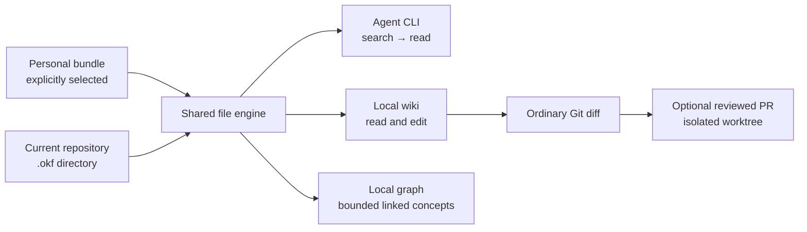

# irudd-okf

Local, scoped knowledge for coding agents and the people working with them.
Store small rules, decisions and lessons as ordinary Open Knowledge Format
Markdown. Search a few relevant files instead of loading the entire corpus.
The CLI is optional: an editor, `rg` and Git work with the same files.



Bundles stay separate. Each result identifies its bundle and path. There is
no implicit search of sibling repositories, embeddings service or encoded
rule precedence. Repository guidance decides how agents use its memories.

## Try it

Linux with glibc and macOS are supported on x64 and arm64. The executable
contains its Node runtime, wiki, graph and agent skill.
Run `irudd-okf licenses` to read the included runtime and dependency notices.

```sh
curl -fsSL https://raw.githubusercontent.com/alundgren/irudd-okf/main/install.sh | bash
irudd-okf init .okf
irudd-okf context
irudd-okf search "test artifacts" --scope repo --limit 5
irudd-okf serve
```

Open the printed `/wiki` or `/graph` address. The server binds to
`127.0.0.1`, and stops with Ctrl+C. Wiki edits compare the version you read
with the file currently on disk. On a conflict, the draft remains available
for comparison and copying. Malformed documents remain accessible as raw text.

Set `OKF_VERSION=v0.1.0` to choose a release or `OKF_INSTALL_DIR` to choose an
installation directory. Running the installer again updates the executable
with its release checksum checked. Remove that executable to uninstall;
your bundles and configuration remain ordinary files.

## Files and agent discovery

A concept needs YAML frontmatter with a nonempty `type`. Other fields and
unknown types are preserved. `index.md` and `log.md` are reserved at every
level. The implementation targets OKF v0.2 independently and uses no
OKF-specific dependency.

```markdown
---
type: Rule
title: Clean test artifacts
tags: [tests]
---

Remove generated test artifacts before committing. Check `git status` after
the test run so unexpected files are visible in the review diff.
```

Teach agents where the bundle is with a short applicable `AGENTS.md` locator.
For example: “Project rules and decisions live in `.okf/`. Consult the index
and search task-relevant files before changing code. Add a small concept when
asked to record a rule. Review memory edits with the code diff.” Adapt this
example to your own repository; retrieval policy is an experiment.

```sh
irudd-okf cli search "find project rules"
irudd-okf cli schema search
irudd-okf search "migration tests" --scope repo --limit 5
irudd-okf read repo architecture/migrations.md
irudd-okf validate
irudd-okf lint
irudd-okf skill install .agents/skills
```

Command results are JSON. Diagnostics go to stderr. The small
[agent skill](skills/okf/SKILL.md) also explains the file-only workflow.
Native skills remain useful for task procedures. Nothing injects the entire
memory corpus or all its triggers into the agent's context.

## Personal plus repository knowledge

Repository `.okf` discovery stays inside the current Git repository. Named
personal bundles are opt-in registrations in
`~/.config/irudd-okf/config.json` (or `$XDG_CONFIG_HOME`).

```sh
irudd-okf init ~/knowledge/me/.okf
irudd-okf bundle add me ~/knowledge/me/.okf --activate
irudd-okf context
irudd-okf search "test cleanup"
irudd-okf search "editor preferences" --scope me
```

Use `--bundle NAME=ROOT` to select an explicit invocation scope. Repository
configuration cannot silently activate folders outside its Git root. Runtime
registrations are separate from the OKF format, and files are never physically
merged. Personal writes through the CLI require `--authorize-personal`; a
person's deliberate wiki edit supplies that authorization.

## Review memory edits as a PR

When a bundle is in Git, the wiki shows changed memory paths. Select files,
prepare a diff, inspect its exact repository and target branch, then submit it.
This uses your installed `git` and authenticated `gh`. The current branch,
index, and unrelated code changes stay untouched. Git hooks and commit signing
are disabled for the isolated memory commit.

```sh
irudd-okf git status repo
irudd-okf git preview repo --paths gotchas/test-artifacts.md --base origin/main
irudd-okf git pr PREVIEW_TOKEN --title "Record test cleanup rule"
```

Fetch the intended base first. A changed source file or target branch requires
fresh preview. Failed publication retains its token and isolated worktree;
retry with the same token after correcting the Git or GitHub error. Preview
state is local under `$XDG_STATE_HOME/irudd-okf` or
`~/.local/state/irudd-okf`. PR submission is always an explicit action.

If termination leaves a short acquisition claim, the error includes its exact
directory, owner PID and age. Confirm that owner has stopped before removing
only the reported `.lock.recovery` directory. Keep the primary lock, journal and
worktree, then retry the same token. Missing ownership requires inspecting the
claim age and ensuring no publication process remains; unknown owners are never
automatically deleted.

## Development and evidence

The product uses Effect 4.0, Foldkit 0.165 and Vite+ 1.0. Node 26.10 is the
build runtime. Generic YAML and Markdown libraries handle syntax; own code
implements OKF semantics.

```sh
npm ci
npm run check
npm run build
node scripts/native-smoke.mjs
npm run okf -- context
```

Native CI executes the built client on Linux and macOS, each on x64 and arm64.
Browser validation exercises the served wiki and graph. See the
[product plan](docs/planning/product-plan.md),
[source research](docs/planning/okf-research.md), and
[controlled experiment protocol](docs/planning/experiment-protocol.md).
The original exploration handoff is retained in
[docs/planning/original-handoff.md](docs/planning/original-handoff.md).

Large-corpus timing and agent-task results are separate measurements. A small
pilot can test instrumentation; it cannot establish that thousands of rules
reliably improve agents. The confirmatory study requires audited equivalent
corpora and independent human ratings. Missing context traces are reported
as unavailable, rather than estimated from file sizes.
