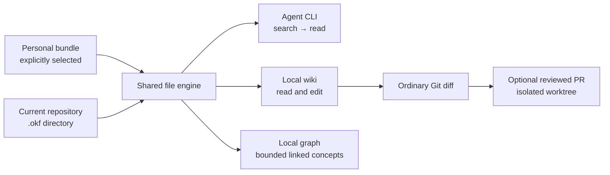

# irudd-okf

Local, scoped knowledge for coding agents and the people working with them.
Store small rules, decisions and lessons as ordinary Open Knowledge Format
Markdown. Search a few relevant files instead of loading the entire corpus.
The CLI is optional: an editor, `rg` and Git work with the same files.



Bundles stay separate. Each result identifies its bundle and path. There is
no implicit search of sibling repositories, embeddings service or encoded
rule precedence. Repository guidance decides how agents use its memories.

## Install

Linux with glibc and macOS are supported on x64 and arm64.

```sh
curl -fsSL https://raw.githubusercontent.com/alundgren/irudd-okf/main/install.sh | bash
```

The installer keeps its own clone in `~/.local/share/irudd-okf/source`, installs
Vite+ if needed, and builds the CLI locally. It installs into `~/.local/bin`
and adds that directory to your bash or zsh login profile. Git and curl are
required. Open a new terminal after installing.

The executable includes its Node runtime, wiki, graph, and agent skill.
Run `irudd-okf licenses` to read the included runtime and dependency notices.

## Try it

From your project's directory:

```sh
irudd-okf init .okf
irudd-okf context
irudd-okf search "test artifacts" --scope repo --limit 5
irudd-okf serve
```

Open the printed `/wiki` or `/graph` address. The server binds to
`127.0.0.1`, and stops with Ctrl+C. Wiki edits compare the version you read
with the file currently on disk. On a conflict, the draft remains available
for comparison and copying. Malformed documents remain accessible as raw text.

Set `OKF_INSTALL_ROOT` to change where the installer keeps its clone, or
`OKF_INSTALL_DIR` to change the executable's location. The installer records
the clone, commit, and Vite+ path beside the executable for future upgrades.

Run `irudd-okf upgrade` from any directory to fetch `origin/main` in that clone.
When `main` has changed, it fast-forwards the clone, installs dependencies with
`vp`, rebuilds, and replaces the executable. It prints JSON such as
`{"previous":"0.1.0","current":"0.2.0","updated":true}` and exits 0 on
success or non-zero on failure. Otherwise it reports `updated: false`
without rebuilding. Local edits, a different branch, or local commits absent
from `origin/main` stop the upgrade. A dependency or build failure leaves the
installed executable intact; run `upgrade` again to retry.

`irudd-okf upgrade --check` exits 0 and prints JSON such as
`{"current":"0.1.0","latest":"0.2.0","updateAvailable":true}`. It leaves the
installation clone, Git refs, and installed files untouched. It reads upstream
metadata in a temporary repository that it removes after checking. Both modes
detect updates by commit, so a change on `main` is available even when the
package version stays the same. Git or network failures exit non-zero.
Scope can run `--check` daily, then run `upgrade` when `updateAvailable` is true.
If an older CLI rejects `--check`, Scope should show
`irudd-okf is too old for automatic upgrades`.

Remove the executable, its installation record, and the installation root to
uninstall. Your bundles and configuration remain ordinary files.

## Files and agent discovery

A concept needs YAML frontmatter with a nonempty `type`. Other fields and
unknown types are preserved. `index.md` and `log.md` are reserved at every
level. The implementation targets OKF v0.2 independently and uses no
OKF-specific dependency.

```markdown
---
type: Rule
title: Clean test artifacts
tags: [tests]
---

Remove generated test artifacts before committing. Check `git status` after
the test run so unexpected files are visible in the review diff.
```

Teach agents where the bundle is with a short applicable `AGENTS.md` locator.
For example: “Project rules and decisions live in `.okf/`. Consult the index
and search task-relevant files before changing code. Add a small concept when
asked to record a rule. Review memory edits with the code diff.” Adapt this
example to your own repository.

```sh
irudd-okf cli search "find project rules"
irudd-okf cli schema search
irudd-okf search "migration tests" --scope repo --limit 5
irudd-okf read repo architecture/migrations.md
irudd-okf validate
irudd-okf lint
irudd-okf skill install .agents/skills
```

Command results are JSON. Diagnostics go to stderr. The small
[agent skill](skills/okf/SKILL.md) also explains the file-only workflow.
Native skills remain useful for task procedures. Nothing injects the entire
memory corpus or all its triggers into the agent's context.

With Vite+ installed, install the skill globally from GitHub for Codex and
Claude Code:

```sh
vp dlx skills add alundgren/irudd-okf --skill okf --global --agent codex claude-code --yes
```

`vp dlx` uses the workspace's selected package manager, including pnpm.
Omit `--agent codex claude-code --yes` to choose agents interactively.
Install the CLI executable separately using the command in [Try it](#try-it).

## Personal plus repository knowledge

Repository `.okf` discovery stays inside the current Git repository. Named
personal bundles are opt-in registrations in
`~/.config/irudd-okf/config.json` (or `$XDG_CONFIG_HOME`).

```sh
irudd-okf init ~/knowledge/me/.okf
irudd-okf bundle add me ~/knowledge/me/.okf --activate
irudd-okf context
irudd-okf search "test cleanup"
irudd-okf search "editor preferences" --scope me
```

Use `--bundle NAME=ROOT` to select an explicit invocation scope. Repository
configuration cannot silently activate folders outside its Git root. Runtime
registrations are separate from the OKF format, and files are never physically
merged. Personal writes through the CLI require `--authorize-personal`; a
person's deliberate wiki edit supplies that authorization.

## Machine-wide agent instructions

Install a short owned section for each provider you want to use with an active
personal bundle. Preview the instruction text and destination before installing:

```sh
irudd-okf instructions install codex personal --dry-run
irudd-okf instructions install codex personal
irudd-okf instructions install claude personal
irudd-okf instructions status codex
irudd-okf instructions remove claude
```

Replace `personal` with the active alias shown by `context`. Installation and
updates replace only the section between the `irudd-okf personal-memory` markers.
Repeated installation is a no-op. Removal leaves other instructions intact.
Existing file permissions are preserved; changed files have a private recovery
copy. `--dry-run` also works for removal and writes nothing. No memory content
is copied into the instruction file, and no skill installation is required.

Codex uses `~/.codex/AGENTS.md`, respecting `CODEX_HOME`. Claude uses
`~/.claude/CLAUDE.md`, respecting `CLAUDE_CONFIG_DIR`. The CLI reports a nonempty
Codex `AGENTS.override.md` as shadowing the shared file and refuses installation
until the override is reconciled. Incomplete or duplicate markers, symbolic
links and non-UTF-8 instruction files are left unchanged. Start a new provider
session to load the updated instructions. See the official
[Codex instruction discovery](https://learn.chatgpt.com/docs/agent-configuration/agents-md)
and [Claude memory documentation](https://code.claude.com/docs/en/memory).

Scope should call these commands on each machine after registering its synced
`personal` bundle, with separate Codex and Claude toggles. Turning one toggle
off should remove only that provider's section. CLI JSON gives Scope the target,
installed state, shadowing, preview text and whether anything changed. Scope's
toggle integration is a later change; this CLI does not enable it automatically.

## Organizing new memories

The owned instruction and OKF skill tell agents to read the root and relevant
topic indexes before writing, search for duplicates, update an existing concept
when appropriate, and review note and index edits together. The root index
links topics; topic indexes link notes. Relative links connect related guidance
and replacements. Existing authoring conventions remain in charge. `init`
creates a small guide for new bundles and never replaces an existing index.

Run `irudd-okf lint --scope personal` after an authorized memory edit. In addition
to broken links, it reports `UNINDEXED_CONCEPT` for notes with no Markdown-link
route from an authored root index. These are optional quality warnings, not
format errors; bundles without a root index remain valid. Lint does not prove
that a note is useful, unique or in the best topic. Ordinary file edits remain
supported and personal writes still require explicit authorization.

The authoring checklist and navigation lint help maintain files and links.
They do not guarantee that an agent will follow every instruction or organize
notes well.

## Review memory edits as a PR

When a bundle is in Git, the wiki shows changed memory paths. Select files,
prepare a diff, inspect its exact repository and target branch, then submit it.
This uses your installed `git` and authenticated `gh`. The current branch,
index, and unrelated code changes stay untouched. Git hooks and commit signing
are disabled for the isolated memory commit.

```sh
irudd-okf git status repo
irudd-okf git preview repo --paths gotchas/test-artifacts.md --base origin/main
irudd-okf git pr PREVIEW_TOKEN --title "Record test cleanup rule"
```

Fetch the intended base first. A changed source file or target branch requires
fresh preview. Failed publication retains its token and isolated worktree;
retry with the same token after correcting the Git or GitHub error. Preview
state is local under `$XDG_STATE_HOME/irudd-okf` or
`~/.local/state/irudd-okf`. PR submission is always an explicit action.

If termination leaves a short acquisition claim, the error includes its exact
directory, owner PID and age. Confirm that owner has stopped before removing
only the reported `.lock.recovery` directory. Keep the primary lock, journal and
worktree, then retry the same token. Missing ownership requires inspecting the
claim age and ensuring no publication process remains; unknown owners are never
automatically deleted.

## Development

The product uses Effect 4.0, Foldkit 0.165 and Vite+ 1.0. Node 26.10 is the
build runtime. Generic YAML and Markdown libraries handle syntax; own code
implements OKF semantics.

```sh
npm ci
npm run check
npm run build
node scripts/native-smoke.mjs
npm run okf -- context
```

Native CI executes the built client on Linux and macOS, each on x64 and arm64.
Browser validation exercises the served wiki and graph. Run it with:

```sh
node scripts/browser-smoke.mjs
```

Browser smoke outputs use a temporary directory and are removed after the run.
Set `OKF_BROWSER_ARTIFACTS` to an output directory outside the repository when
you need to retain screenshots and results. CI retains these as workflow artifacts.
